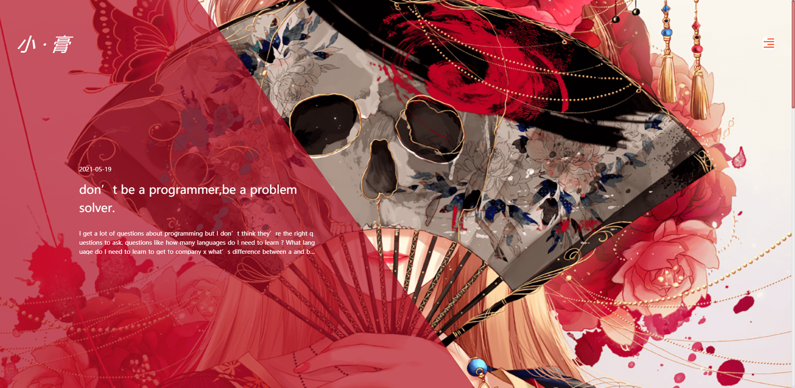

# 
Litter.Dragon

    
   
    
     
    
    
    
    
     
    
    
    
    
    

## ☠️ ONE PIECE

    

## 🤩 功能介绍
均尝试使用 TS（typeScript 4.x）编写
- `WEB 端`

    -  首页大屏(HOME)效果通过parallax.js和根据屏幕宽高比动态计算.
    -  首页文章列表(HOME)数据查询.查看人数,喜欢人数。
    -  文章详情(DETAIL)根据文章的id查询文章的评论,详细内容,用户评论。滑块验证用户评论,下载加载更多,点赞喜欢。
    -  文章列表(ARTICLE),按月份分类排序加载,下拉加载更多
    -  Little.Dragon博客订阅(SUBSCRIBE)输入邮箱,会发送一个email验证码,和一个链接,验证通过后,可订阅博客。
 
 - `ADMIN 端`
  
    - 登录权限
    - 文章的列表,对应的增删查改
    - 评论的列表,对应的增删查改
    - 订阅用户列表,对应的取消订阅

- `SERVE 端`
    - http 请求处理，数据库数据交互

## 🤪 效果图 
 - web页面点这里, → [Little.Dragon](http://longjiuwei999.com)

## 🙃 目录
 - vue3.0_web_admin 请不要管它,看大佬搓vue3.0很nice,就想跟风重构一版vue3.0的后台管理,后来.....不了了之。
 - server node服务端代码,前端的http请求处理,和操作数据库,用express搭建的http服务和mysql2操作数据库,multer上传文件。
 - web  next.js构建的React项目,均采用服务端渲染方案.
 - web_admin create-react-app 构建的SAP单页面应用项目,TS+React+ant-design+redux, redux全家桶(redux+react+redux+immer+reselect+saga) 用的不多,只是在登录的哪里用了一点,后来发现redux用在这个小项目如杀鸡用牛刀。

 ## 🌈 提示
  1. 将项目拉下来,你需要有mysql环境和node环境。3个文件最好使用yarn和淘宝源来进行依赖包的下载。如果下载失败,请换一台电脑(嘿嘿~开玩笑),请使用rimraf 命令 卸载node_modules 文件重新下载,如都不行,去[Little.Dragon](http://longjiuwei999.com/aboutMe)添加我的微信,我为你解答。

## 💯 古言古语

> 生活的所有馈赠,都在暗中标好了价码。

> 希望生活美好, Peace Love 
